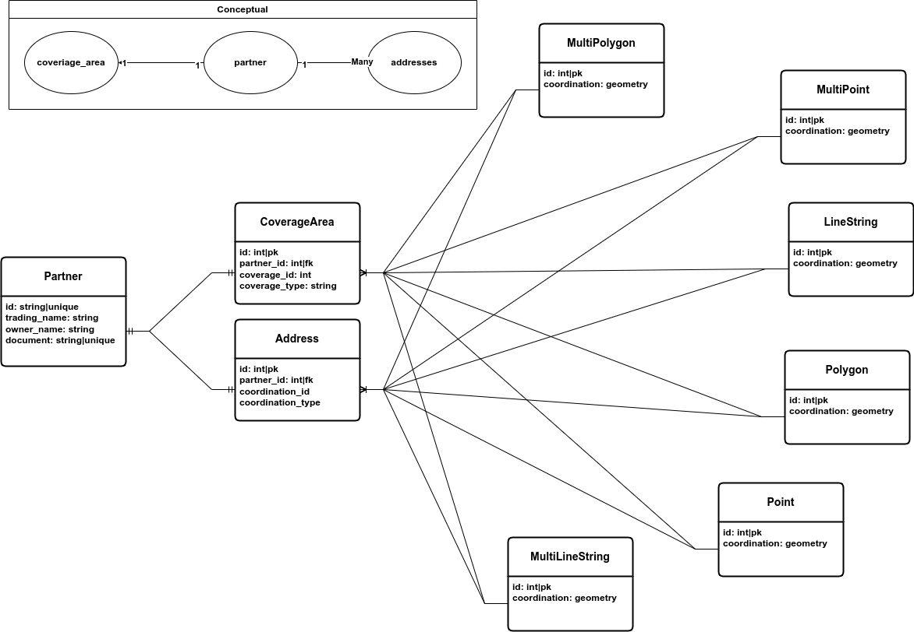

# Express Application

This application provides an API (Application Programming Interface) to deliver packages.

**Note** please pay attention that because of the lake of time I did not use transactions
explicitly when storing the partners data in the system, but I have done such things in
my other project's before, therefore if you wish to see how I would done it you can check
this [OrderRepository](https://github.com/adnanahmady/coffee-shop/blob/main/backend/app/Repositories/OrderRepository.php)
file from my coffee shop project which is publicly available to see.

## Index

* [Requirements](#requirements)
* [Usage](#usage)
  * [Run the application](#run-application)
  * [Check the status of the application](#status)
  * [Bring down the application](#down)
  * [Destroy the application belongings](#down)
* [Tests](#tests)
  * [Get test coverage report](#coverage-report)
* [Database Diagram](#diagram)

## Structure

The project structure is as bellow

- .assets `The assets of the readme file are placed here`
- .web `The nginx configurations are placed here`
- .backend `The backend application configurations are placed here`
- [backend](./backend) `The backend application itself is placed here`
- .gitignore `The assets that should be ignored by git`
- docker-compose.yml `docker compose configuration`
- Makefile `This file is here to help working with the project`

## Requirements

You need `docker` and `docker-compose` in order to run this application.
If you don't have `make` on your operating system for running the application,
you need to read `Makefile` and do as `up` method says, otherwise you just need
to follow [Running](#run-application) section.

**Caution** your operating system's user needs to be able to run docker without
requiring the `sudo` prefix.

## Usage

In this section working with the application is described.

## Run Application

for running application you need to execute `up` method using `make` command
like bellow:

```shell
make up
```

## Status

If you need to check the project's container states, you can do so
by one of the bellow commands.

```shell
make ps
make status
```

## Down

You can stop the project using bellow command.

```shell
make down
```

## Destroy

If you wish to destroy the project's allocated volumes and containers
you can do so like this.

```shell
make destroy
```

## Tests

You can run tests outside the application's container by `make` tool using
bellow command.

```shell
make test
```

## Coverage Report

You can get a nice test coverage report from the PHPUnit by running
this command.

```shell
make coverage
```

This command will create a coverage folder under `./backend/tests/.coverage` folder
for you, and then you can open `index.html` file in the `.coverage` folder so
you can visually see the test covered parts of the project.

# Diagram

**Caution** the diagram is showing full picture of the database
design that is supposed to be but for the sake of `YAGNI` only
the parts that were using got implemented.

The reason that I have implemented the address with a free type
is if in future there be any need to change the address of the
partner from point to for example a multipoint the relations be
correct. and using the polymorphic relation the type of the field
can you restored again.


